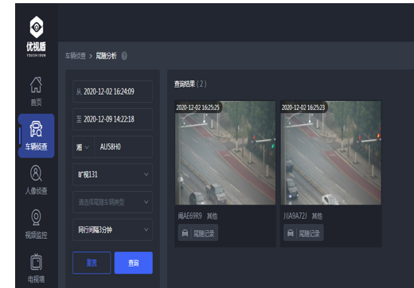

# elasticsearch-custom-query-demo
This query plugin is used to overcome the complicated script query in a Vehicle trailing analysis.

The requirement is somewhat like below:
尾随分析：根据目标车辆过车的前后时间，经过的地点（可多选设备），找到目标车辆的尾随车辆。（结果返回最多1000条结果）

`实现思路`：

1) 建立如下索引结构：k1...kN为卡口ID，即DeviceID, kN对应的值为该车经过该卡口时的拍照时间，即shotTime，时间按顺序排列好，该索引可按月创建，id字段为车牌唯一ID。模拟数据如下所示：
<pre>
     {
    	"id":4,
    	"plateNo" : "car4",
    	"k1" : [
            3,
            13,
            23,
            33
            ],
    	"k2" : [
            4,
            14,
            24,
            34
            ],
    	"k6" : [
            16,
            26,
            36,
            46
            ]
    }
</pre>
2) 运用bool query 来查询经过卡口为k1,k2,k3的车辆，使用minimum_should_match来控制必须经过的卡口数量；并使用must_not排除掉被尾随车辆本身。
<pre>
{
  "query": {
    "bool": {
      "should": [
        {
          "exists": {
            "field": "k1"
          }
        },
        {
          "exists": {
            "field": "k2"
          }
        },
        {
          "exists": {
            "field": "k3"
          }
        },
        {
          "exists": {
            "field": "k4"
          }
        }
      ],
      "minimum_should_match": 3,
      "must_not": [
        {
          "term": {
            "plateNo": {
              "value": "car1"
            }
          }
        }
      ]
    }
  }
}
</pre>

3) 用自定义查询，来过滤数据，把满足时间间隔（如3分钟...10分钟）的数据筛选出来。
<pre>
{
  "query": {
    "bool": {
      "should": [
        {
          "exists": {
            "field": "k1"
          }
        },
        {
          "exists": {
            "field": "k2"
          }
        },
        {
          "exists": {
            "field": "k3"
          }
        },
        {
          "exists": {
            "field": "k4"
          }
        }
      ],
      "minimum_should_match": 2,
      "must_not": [
        {
          "term": {
            "plateNo": {
              "value": "car3"
            }
          }
        }
      ]
    }
  },
  "post_filter": {
    "timeRangeExist": {
      "fields": [
        "k1",
        "k2",
        "k3",
        "k4"
      ],
      "target_value": "car3",
      "target_field":"plateNo",
      "minMatch": 3,
      "timeInterval": 10
    }
  }
}

</pre>

###插件参数说明：
<pre>
    timeRangeExist: 自定义函数名称，跟termquery等类似，可以用在查询，也可以用在过滤上。
    fields: 过滤时，待比较的字段列表，比如经过多个卡口，则每一个卡口(摄像头)就是一个索引的字段；注意：索引时，该字段一定要store=true.
    target_field & target_value, 表示要比较查询的字段与值；该场景即通过该字段与值定位到被尾随的车辆。
    target_field: 索引时, index type 需要为keyword, 因为查询时用的是termquery，如plateNo字段。
    target_value: 查询的值，如湘A1DJ29
    minMatch: 最少匹配的字段数量，即匹配fields的个数。
    timeInterval: 时间间隔，单位为：ms。 如果是3分钟的话，请传：3*60*1000
 </pre>
### mapping 示例：
<pre>
{
  "car2021" : {
    "mappings" : {
      "properties" : {
        "PlateNo" : {
          "type" : "keyword"
        },
        "id" : {
          "type" : "keyword"
        },
        "k1" : {
          "type" : "text",
          "store" : true
        },
        "k2" : {
          "type" : "text",
          "store" : true
        },
        "k3" : {
          "type" : "text",
          "store" : true
        },
        "k4" : {
          "type" : "text",
          "store" : true
        },
        "k6" : {
          "type" : "text",
          "store" : true
        },
        "plateNo" : {
          "type" : "text",
          "fields" : {
            "keyword" : {
              "type" : "keyword",
              "ignore_above" : 256
            }
          }
        }
      }
    }
  }
}
</pre>
 
    
